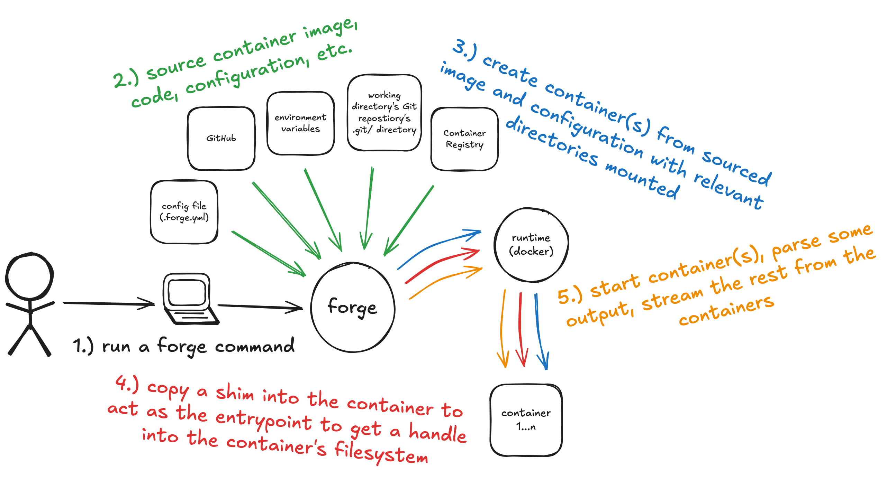

# Developing Forge

First, ensure you've installed the necessary prerequisites:

- `git` is _required_.
- `go` >=1.20 is _required_ for multi-error handling.
- `docker` is _required_ to test as it is its only runtime.
- `make` is _recommended_.
- [`upx`](https://github.com/upx/upx) is _required_ for compressing [`shim`](https://github.com/frantjc/forge/blob/main/internal/cmd/shim/main.go).
- `node` >=20 is _required_ for developing the [action](https://github.com/frantjc/forge/blob/main/.github/actions/setup-forge).

Next, get an understanding for how `forge` works. Each `forge` command follows roughly the same pattern:



Finally, get an understanding for some useful `make` commands.

```sh
# Run forge's tests.
make test
# Install forge.
make install
# Regenerate all of forge's generated code.
make generate
```

The source code for the `shim` as well as a built version of the binary itself live in this repository. The `shim` is then embedded inside of `forge` using `go`'s `embed` package. Building `forge` will use the current version of the `shim`, even if changes have been made to code that the `shim` uses since it was last built. That is to say, if one wanted to test changes made to the `shim`, they must first rebuild it. Beware, this can be a slow process due to use of `upx` to ensure the `shim` is as small as possible to speed up copy times during the execution of `forge` commands.

```sh
# Build the shim for the current GOARCH.
make shim
# Build the shim for each supported GOARCH values.
make shims
```
