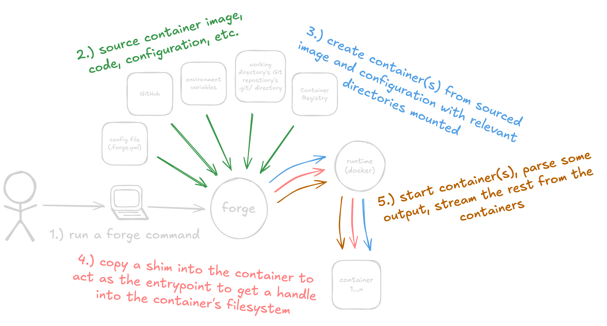

# Developing Forge

- `git` is _required_
- `make` is _required_
- `go` >=1.20 is _required_ for multi-error handling
- `docker` is _required_ to test as it is its only runtime
- [`upx`](https://github.com/upx/upx) is _required_ for compressing [`shim`](https://github.com/frantjc/forge/blob/main/internal/cmd/shim/main.go)
- `node` >=20 is _required_ for developing the [`action`](https://github.com/frantjc/forge/blob/main/.github/action)

